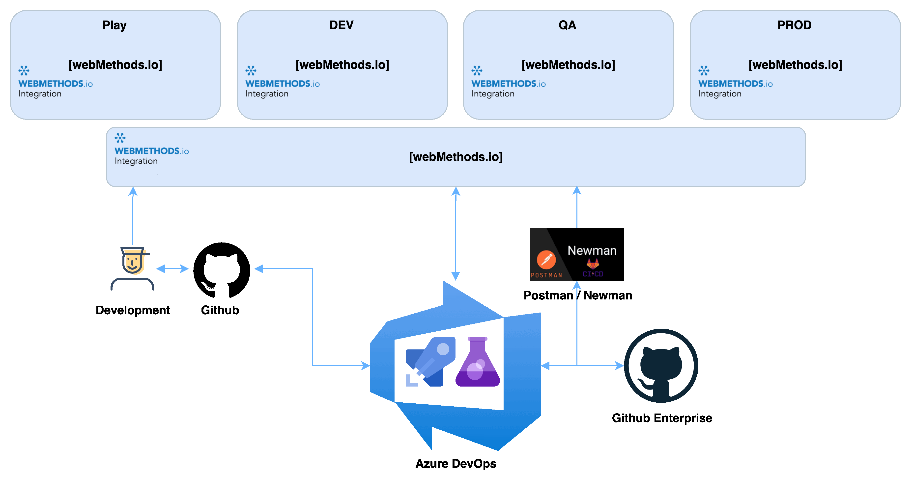

# 🚀 webMethods.io Integration DevOps Framework — Extended

This document extends the [original automation framework for webMethods.io Integration](https://community.ibm.com/community/user/integration/viewdocument/devops-for-webmethodsio-integratio?CommunityKey=82b75916-ed06-4a13-8eb6-0190da9f1bfa&tab=librarydocuments), highlighting new capabilities such as API-first integration, multi-asset promotion, integrated code review, and secret vault support. The framework is designed for GitHub repositories and Azure DevOps pipelines but can be adapted to other platforms.

---

## 📌 What's New

- ✅ **API (Integration) Support**  
  Automate REST API-based integrations, alongside workflows, flowservices.

- ✅ **Multi-Asset Promotion Support**  
  Promote multiple assets (APIs, workflows, flowservices, reference data, projectParameters) together in a single release cycle. (Complete Project support has been there from begining)

- ✅ **Integrated Code Review Process**  
  Added "code review" as a qulaity gate using ISCCR (Licensed) for flow services.

- ✅ **Secret Vault Integration**  
  Sensitive credentials (tokens, client secrets, credentials) are stored in Azure Key Vault or GitHub secrets and auto-injected during deployments.

- ✅ **Simplified Configuration Management**  
  YAML-based project configurations track accounts, secrets, and environment-specific metadata.

---

## 📈 Framework Overview

1. **Export & Version Control**
   - Assets are exported from webMethods.io using APIs.
   - Secrets are extracted, masked, and stored separately.
   - Code and metadata are committed to GitHub.

2. **Pull Request & Code Review**
   - Developers raise pull requests for new or updated assets.
   - Code review workflows ensure peer validation before merge. This could also be triggered on PRs (say feature --> codeReview branch)

3. **Promotion & Deployment**
   - Azure DevOps triggers automate import and deployment.
   - Vault secrets are dynamically injected before deployment.
   - Supports batch promotion of multiple assets.

4. **Automated Testing (Optional)**
   - Postman/Newman test collections validate assets post-deployment.

---

## 🛠️ Components

| Component        | Role                         |
|------------------|------------------------------|
| Azure DevOps     | CI/CD Pipeline Orchestration |
| GitHub           | Source Control + Code Review |
| Azure Key Vault  | Secret Storage               |
| Postman/Newman   | Automated Testing            |
| webMethods.io    | Target Integration Platform  |

This is a sample setup, but definitely not limited to the above components, framework could be used with other components like, bitbucket, bamboo, gitlab, jenkins etc.

---

## 🔐 Vault Integration

- Secrets stored securely in:
  - Azure Key Vault (recommended for Azure-hosted projects)
  - GitHub Encrypted Secrets (fallback)

- During import, masked fields are dynamically replaced with actual secrets from vault.

---

## ⚖️ Multi-Asset Promotion Workflow (Individual asset promotion)

- Supports selecting and promoting multiple assets together:
  - APIs
  - workflows
  - flowservices
  - Reference Data
  - Project parametets

---

## 📊 Code Review Enforcement

- Feature branch-based development.
- Pull Requests mandatory before merging to DEV/QA/PROD branches.
- Peer reviews using GitHub workflows.
- Secrets never committed in clear text.

---

## 📊 Example Pipelines

| Stage            | Trigger            | Outcome                         |
|------------------|--------------------|---------------------------------|
| **Initialize**   | Manual             | New project + repo setup        |
| **Synchronize**  | Manual             | Export + Commit assets          |
| **Promote to DEV**| PR to DEV         | Import assets, inject secrets   |
| **Promote to QA** | PR to QA          | Batch deploy + automated tests  |
| **Promote to PROD**| Manual Approval  | Deploy to production            |

---

## 📘 Documentation & Resources

- [Framework Repository](https://github.com/IBM/webmethods-io-int-cicd)
- [IBM webMethods.io API Docs](https://www.ibm.com/docs/en/wm-integration/11.0.11?topic=reference-webmethods-integration-apis)
- [Official CLI](https://github.com/SoftwareAG/webmethods-io-integration-apicli (Being Migrated))
- [Original Framework](https://community.ibm.com/community/user/integration/viewdocument/devops-for-webmethodsio-integratio?CommunityKey=82b75916-ed06-4a13-8eb6-0190da9f1bfa&tab=librarydocuments)

---

## 🤝 Contribution

- Fork → Enhance → Pull Request.
- Contributions welcome for:
  - New orchestration platform adapters.
  - Additional secret providers.
  - Pipeline optimization.

---

## ⚠️ Disclaimer
## IBM Public Repository Disclosure
All content in these repositories including code has been provided by IBM under the associated open source software license and IBM is under no obligation to provide enhancements, updates, or support. IBM developers produced this code as an open source project (not as an IBM product), and IBM makes no assertions as to the level of quality nor security, and will not be maintaining this code going forward.

---

## 🚀 Next Steps

- Develop Anywhere Deploy Anywhere (DADA / IWHI) support.
- Individual asset support
- Unit Testing.

